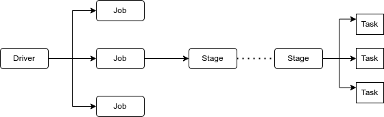

# Spark Job, Stages and Tasks

### Interview question:


1. What is a job, stage and task in spark? What is application?
2. How many job will be created in the given piece of code? ---> The number of jobs will be equal to action
3. How many stages will be created?
4. How many tasks will be created?

```python
from pyspark.sql.functions import *
spark = SparkSession.builder.master("local[5])\
        .appName("testing)\
        .getorCreate()
```


Application --> Any command we submit via `spark-submit` to run on our cluster is called a application.

Job --> Any action in a application is called a job. A action creates a job.

Stage --> A job/action is divided into small parts called stages. This is logical.

For Example: We have a job to buy pens from market. Steps to perform this job:

1. Go to market
2. Go to shop
3. Check if the shop has required pen, if not available go to another shop, or ask for another product.

The different steps/transformations we have in our job are stages.

Task --> The actual tasks being performed on the data. Until stage everything is logical, the physical action on data is known as task. Task run actually on executor.

* Now in interview, a code snipped will be given and we will be asked to tell the number of jobs, steps and tasks.



```python
employee_df = spark.read.format("csv")\ ---> action
.option("header","true")\
.option("inferSchema","true")\ ---> action
.load("/path/to/employee_data.csv")
print(employee_df.rdd.getNumPartition())
employee_df = empoloyee_df.filter(col("salary")>90000)\
.select("id","name","age","salary")\
.groupby("age").count()
employee_df.collect() ---> action
input("Press enter to terminate")
```

data read ---> reparition ---> filter ---> select ---> groupby ---> collect


* Let's consider our data was < 128MBs so there will be only one partition.
* After repartitioning it will be distributed among 2 partitions.
* Now the filter and select being narrow-body transformation will run on both the partitions separately.
* since `groupby` is a narrow-body transformation, we need to shuffle the data to bring same keys together.


**Note:**
* Any job will have at least one stage.
* Any stage will have at least one task.

Wherever the is a wide-body transformation, we get a new stage.


* Now for job-1: read-csv
* Now Job-2: From Repartition till collect()

stage -1: reparition
stage-2: filter and select
stage-3: groupby

**Note:** For every partition there will be new task.


During repartition-shuffling, there will be `write-exchange` to create 2 partitions. 


These 2 partition will be read in filter separately via
`read-exchange`. For each of the partition there will be a task created hence there will be 2 partition.


Now, coming to group by(wide body transformation)

Now for count, same key will be brought to same partition and wide-body transformation will be performed.

**Note:** By default there are 200 partitions.

So, for groupby() there will be 200 tasks.