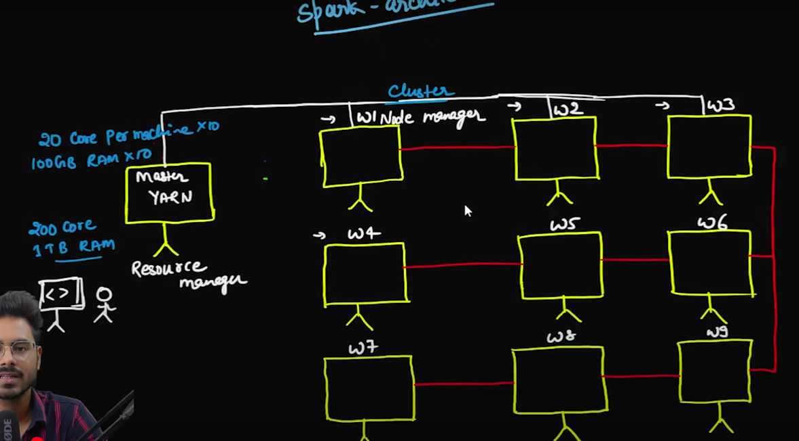
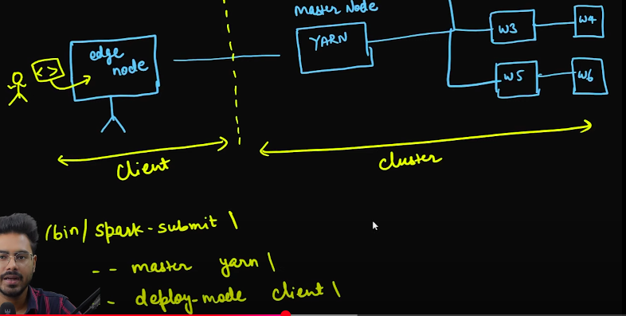
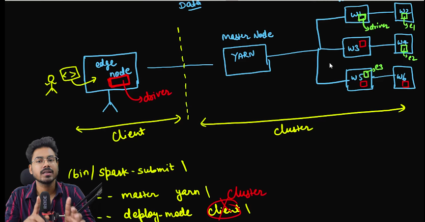
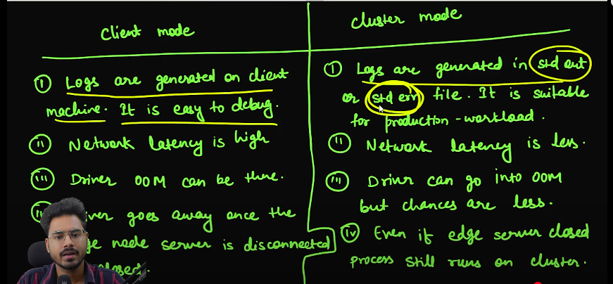

# Deployment mode in Spark

## Potential interview questions

1. What all deployment modes are there in spark?

2. What is edge node?

3. Why do we need client and cluster modes?

4. What will happen if I close my edge node?

## Spark-architecture refresher

## Edge node

The machine where user can submit spark command

It can also be used for kerboros authentication and authorization.

User can also use edge node to submit data. Edge node than submits this dat to master which can property distribute data onto the cluster.

On Edge node we don't have YARN, we only have Hadoop client.

In every company there is Hadoop administrative team that provisions the edge node.

Since we are going to need spark-submit, we need to install spark on Edge node. But we only need Hadoop client library but not YARN.

Installation is work of Hadoop administrative team.

## Client mode

### Closing the edge node

In client mode, if closing the edge node will kill the driver as driver is on edge node. This will close all executor

### Advantages of Client mode

* Advantages when running the small snippet as the logs will be easily available on edge node.

* In Notebook also client mode i

### Disadvantages of client mode

* There is a network latency as the driver is located in edge node which is located separately from rest of cluster.

## Cluster mode

### Advantages

* Low network latency.
* Spark application keeps on running even when the edge node is shut down.

In cluster mode we get a application_id. Using this application_id we can access Spark WebUI log corresponding to spark application.

